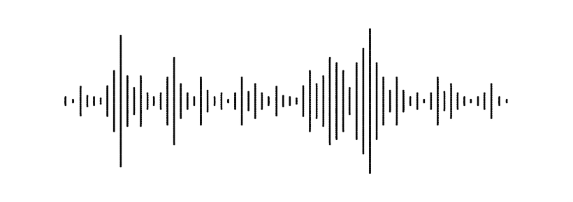

<div align = "center">
    <h1>Harmonized</h1>
    
    <h3>Tool for solving harmonics tasks</h3>
</div>

## Installation steps


### Requirements

Make shure you have installed
 - `rust`
 - `cargo`
 
If not:
- Download and run rust install for Windows 64 bit - <a href="https://static.rust-lang.org/rustup/dist/x86_64-pc-windows-msvc/rustup-init.exe">link</a>
- Download and run rust install for Windows 32 bit - <a href="https://static.rust-lang.org/rustup/dist/i686-pc-windows-msvc/rustup-init.exe">link</a>
- Linux users can do it by themselves
 
### Building or running
Check for prebuilds in <a href = "https://github.com/clowzed/harmonized"> releases</a> or build it by yourself

### Installation
```bash
cd <directory you prefer>
git clone https://github.com/clowzed/harmonized.git
cd harmonized
```

### Running
```bash
cargo run --release
```

### Building and configuring
```bash
cargo build --release
# Now you need to place harmonized.exe in any directory you prefer and add to PATH

(sudo?) mv ./target/release/harmonized.exe /dir/you/prefer
# If you want to save code remove only target folder
rm -rf ./target

# Or just
rm -rf ../harmonzed
```
## Roadmap
* [ + ] ~~*Configure normal input with dialoguer*~~ [2022-02-01]
* [ + ] ~~*Check splitting notes to accords and then into tacts*~~ [2022-02-01]
* [ - ] Simple solving steps
* [ - ] Add strict rules of harmonics
* [ - ] Think of good output of solution (file format)
* [ - ] Complete the task :)


### About me and project
This project is written for my friend who is a great musician and whos mind was blowed by programming.
It's not very serious but maybe one day it will help other people.

